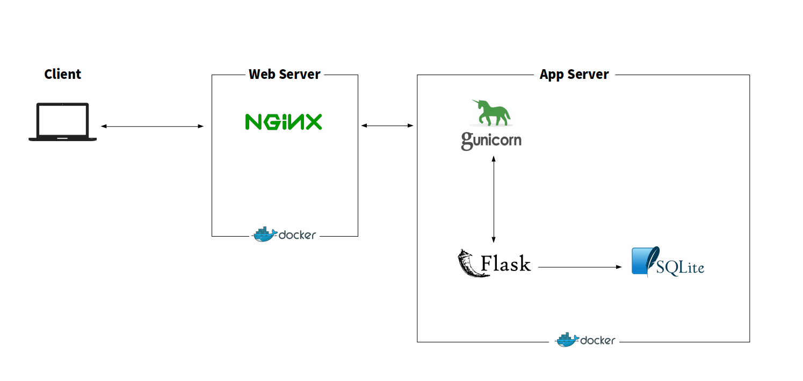

# Flask_NLP_App

A simple Flask application using NLP models. (Japanese only)

・Headlines Generation

・Easy Japanese (Simplification of Japanese)

・Grammer Correction (Supports only kanji correction and character correction)

#### Only CPU enviroment is supported. GPU enviroment is not supported.

<br>

## Overview

<br>



<br>

## Usage

### Setting

You'll need to prepare the secretkey and user information in a yaml file.

```
flask/flaskapp/yaml/secretkey.yml
flask/flaskapp/yaml/user.yml
```

example: `secretkey.yml`

```
'secret_key'': 'hoge'
```

example: `user.yml`

```
'user_id': 0
'user_name': 'hoge' 
'password': 'hogehoge'
```

Prepare the finetuned nlp model in the directory.

```
flask/flaskapp/ml_model/
```

If you want to prepare test data for inference, 

please prepare it as `sample.txt` in the following directory.

```
flask/flaskapp/sample_data/
```

### Docker

```
docker-compose up -d --build
```
<br>

## Headlines Generation, Easy Japanese

#### The finetuning repository is [here](https://github.com/KoshiroSato/Simple_Transformers_mT5_finetuning).

### Model

Multilingual-T5

https://arxiv.org/abs/2010.11934

https://github.com/google-research/multilingual-t5

Simple Transformers

https://simpletransformers.ai/

https://github.com/ThilinaRajapakse/simpletransformers

### Dataset used for model training

#### Headlines Generation

livedoor news corpus

https://www.rondhuit.com/download.html#ldcc

The following script was used to generate the dataset.

https://gist.github.com/nxdataka/48a27b2e1c3f029e7f25e66dba4b6dde

#### Easy Japanese

SNOW T15: Japanese Simplified Corpus with Core Vocabulary

https://www.jnlp.org/GengoHouse/snow/t15

SNOW T23: Crowdsourced Corpus of Sentence Simplification with Core Vocabulary

https://www.jnlp.org/GengoHouse/snow/t23

<br>

## Grammer Correction

#### The finetuning repository is [here](https://github.com/KoshiroSato/grammer_correction_pytorch_lightning).

### Model

BERT base Japanese

https://huggingface.co/cl-tohoku/bert-base-japanese-whole-word-masking

### Dataset used for model training

[Japanese Wikipedia input error dataset (v2)](https://nlp.ist.i.kyoto-u.ac.jp/?%E6%97%A5%E6%9C%AC%E8%AA%9EWikipedia%E5%85%A5%E5%8A%9B%E8%AA%A4%E3%82%8A%E3%83%87%E3%83%BC%E3%82%BF%E3%82%BB%E3%83%83%E3%83%88)

<br>

## Sources/references/credits

flask-docker-ec2

https://github.com/srcecde/flask-docker-ec2